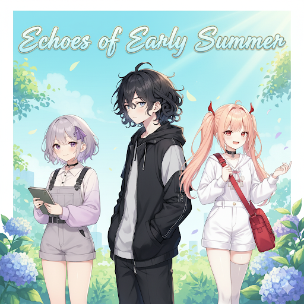

# **初夏回响：瞬时之城**

## **世界观**

> 📖 **详细世界观设定请参阅：** [世界观设定集](./WorldView.md)

瞬时之城是一个只存在于"一个无限循环的初夏日"里的城市。它在每日的黎明时分从晨雾中浮现，在黄昏时随着光线一同消融，第二天又以相似但细节不同的面貌重生。

### **核心特色**

- **城市法则**：  
  城市每日苏醒与消散，布局大致不变但细节更新，黄昏后进入蛰伏期。  
- **城市构成**：  
  由独特材质（如夏日白石、风干木）和现象（如日长石、晨雾玻璃）构成。  
- **时间系统**：  
  以"初夏轮回历"标记时间，如"晨雾启明"、"七点晚霞盛宴"等时段定义节律。  
- **回响机制**：  
  过往时光的短暂重现（瞬时回响）或永久刻印（如痕迹、造物）。 

## **人物**

> 📖 **角色详细设定请参阅：** [角色设定集](./characters/characters.md)

他们是这座城市的原生居民，是亲密无间的朋友与家人。他们的友谊与亲情，是这座城市中唯一不变的"永恒地标"。

### **角色概览**

- **琦霞(Qi Xia)：**  
    定位: 贪玩的守护者  
    关键词: 守护, 贪玩, 担当  
    
    [琦霞的设定集](./characters/QiXia/QiXia.md)  

- **安柴(An Chai)：**  
    定位: 沉静的记录者  
    关键词: 感受, 记录, 安静  

    [安柴的设定集](./characters/AnChai/AnChai.md)  

- **纸灰灰(Paper Gracie)：**  
    定位: 好奇的探险家  
    关键词: 探索, 智慧, 计划  

    [纸灰灰的设定集](./characters/PaperGracie/PaperGracie.md)

## **故事**

> 📖 **故事集目录：** [日常故事](./daily_stories/README.md) | [外部故事](./external_stories/README.md)

### **日常故事集**

奇妙的元素构成瞬时之城的景致，回环往复的城里经历精彩纷呈的生活。收录琦霞、纸灰灰和安柴在瞬时之城中的日常冒险与温馨时光。

**已收录故事：**

* (待改) [第一回初夏·三幕：雨日手帖](./daily_stories/第一回初夏·三幕：雨日手帖.md)

### **外部故事集**

瞬时之城是世外桃源的美妙天地，却并非世界的孤岛。穿越边缘的漩涡，或许能进入一段奇妙的冒险......

**已收录故事：**

* [漫步江南](./external_stories/001_漫步江南/001_漫步江南.md) - 江南烟雨中的诗意漫游