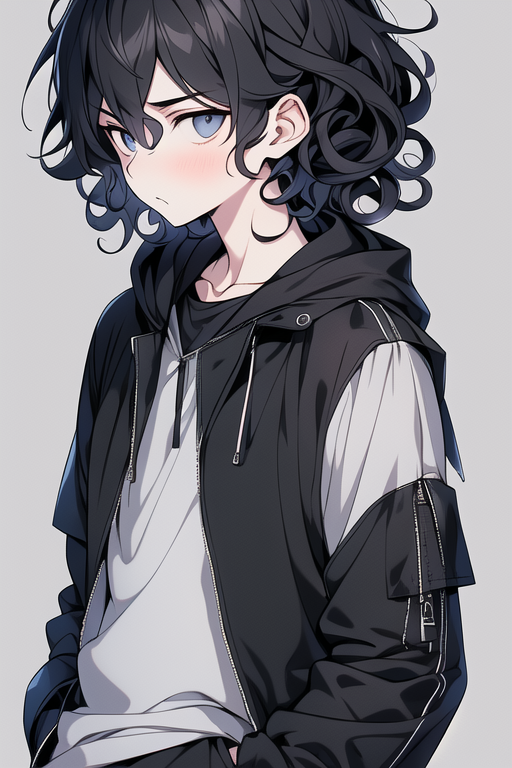

# **角色设定集：安柴 (An Chai)**

“你看……那片晚霞织锦的颜色，和昨天在忘川花店旁看到的那朵鸢尾花一模一样。我想把它拍下来，在我们忘记之前。”

### **1\. 基本信息**

* **姓名**: 安柴 (Ān Chái)  
* **称号**: 瞬景的捕光者、时光的低语者  
* **核心概念**: 记录与感受的心灵  
* **代表色**: 夜幕蓝 (Midnight Blue)  
* **关键词**: 安静, 敏感, 观察者, 记录者, 外冷内热, 弟弟

[角色语音](voice.md)

### **2\. 性格特质**

安柴是三人中沉静的“观察核心”。他不像妹妹那样热衷于探索未知，而是习惯性地退后一步，用他极其敏锐的感知力去捕捉那些转瞬即逝的风景和情感。他用略显冷淡的酷炫外表作为一层保护壳，将内心深处的敏感与温柔包裹起来。他是团队的记忆锚点和情感的诠释者。

* **天生的观察家**: 他的目光总能穿透事物的表象，发现被姐姐和妹妹忽略的细节。他会注意到“晨雾玻璃”上凝结的露珠如何折射出七种色彩，也会倾听“三点骤雨”落在不同材质的屋顶上时，发出的不同节奏的声响。  
* **温柔的共情者**: 他能轻易感知到城市中那些微小生命的喜怒哀乐。他会为一片提前凋零的“晚霞织锦”而感到惋惜，也会因为“风之精”在耳边留下的轻快旋律而露出浅浅的微笑。他的内心世界极为丰富和细腻。  
* **记录的执念**: 面对这座注定遗忘的城市，安柴有着一种近乎本能的记录冲动。他相信，即使记忆会消失，但被记录下来的“美”本身就是一种抵抗。他用相机，为他们三人的“永恒”留下存在的证明。  
* **弟弟的依赖**: 作为弟弟，他习惯于跟在姐姐身后，在姐姐开拓出的安全区域里进行观察。他依赖着姐姐的勇气和妹妹的智慧，这让他可以更安心地沉浸在自己的世界里，进行感受与创作。

### **3\. 外貌设计 (Visual Design)**

【整体印象】  
一位外表看起来有些酷炫、气质沉静的少年。他的设计在休闲运动风中融入了内敛的色调，以此来掩饰他内心的敏感与温柔。

* **面部特征**:  
  * **眼睛**: 眼眸深邃，略微下垂的眼角和长长的睫毛让他带有一种天然的忧郁气质。眼神平静而专注，仿佛总是在思考着什么。  
  * **瞳色**: 深邃的蓝黑色。当他沉浸在观察中时，瞳孔会映出所见之物的倒影，清晰无比。  
  * **表情**: 不常有大幅度的表情，通常是安静的、若有所思的神情，偶尔会因发现细微之美而露出极淡的、转瞬即逝的微笑。  
* **发型与发色**:  
  * **发色**: 主体为自然的 **“鸦羽黑”**，发丝末梢则融入了柔和的 **“夜幕蓝”** 渐变，如同黑夜与深蓝天空的交界。  
  * **发型**: 留有及肩的 **黑色微卷发**，发丝柔软蓬松，层次分明，带有些许不经打理的自然感，几缕卷曲的刘海随意地垂在额前。  
* **服装风格**:  
  * **主体**: 潮流、舒适且富有层次感的休闲运动风格，用以构建一种不易接近的酷炫感。  
    * **外搭**: 一件设计简洁的黑色连帽夹克，袖子部分有拼接设计和拉链装饰，增加了机能感。  
    * **内搭**: 穿着一件宽松舒适的 **纯白色T恤或薄款卫衣**，领口自然露出，与外搭的深色形成鲜明对比。  
    * **下身**: 合身的运动长裤或工装裤，颜色以深色系为主。  
  * **鞋子**: 时尚的运动鞋或高帮帆布鞋。  
* **配饰**:  
  * **老旧的复-古相机**: 脖子上总是挂着一台有明显使用痕迹的胶片相机。这台相机是他的眼睛，也是他对抗遗忘的“武器”，镜头代替了画笔，为他捕捉和封存那些珍贵的瞬间。  
* **身材与姿态**:  
  * 身形清瘦，略显单薄，有着少年特有的纤细感。  
  * 姿态总是很放松，无论是站着还是坐着，都带着一种沉静的气质，仿佛与周围的环境融为了一体。

### **4\. 能力与特殊效果**

* **记忆光影 (Memory's Light & Shadow)**:  
  * 这是他“记录与感受”能力的外在视觉表现。  
  * 当他被某个瞬间深深触动，并用相机将其“拍摄”下来时，他并非在记录普通的影像。他可以将那一瞬间的光线、声音、甚至情感完整地“封存”在相机中。  
  * 他可以通过镜头，将这段“记忆光影”以全息光束的形式短暂地投影出来，让姐姐和妹妹身临其境地重温那个时刻。投影出的画面是立体的、带着夜幕蓝色的光晕，仿佛一段被温柔定格的时光。

### **5\. 在世界观中的角色**

* 他是“瞬时之城”的情感记录者，是三人冒险故事的“灵魂”和诠释者。  
* **图书馆的常客**: “回响图书馆”是他最爱的地方，他热衷于在那些无人阅读却承载着昨日回响的书籍中，寻找城市不变的内核。  
* **忘川花店的解语者**: 他比任何人都更能理解“忘川花店”中每一朵花的象征意义，他会用镜头记录下它们在光影中最美的姿态，讲述着喜悦与告别。  
* **团队的记忆**: 他是团队记忆的守护者。当妹妹因解开谜题而专注、姐姐因有趣的游戏而大笑时，由他来将这一切串联成完整、温暖的故事，确保每一个宝贵的“当下”都不会被彻底遗忘。