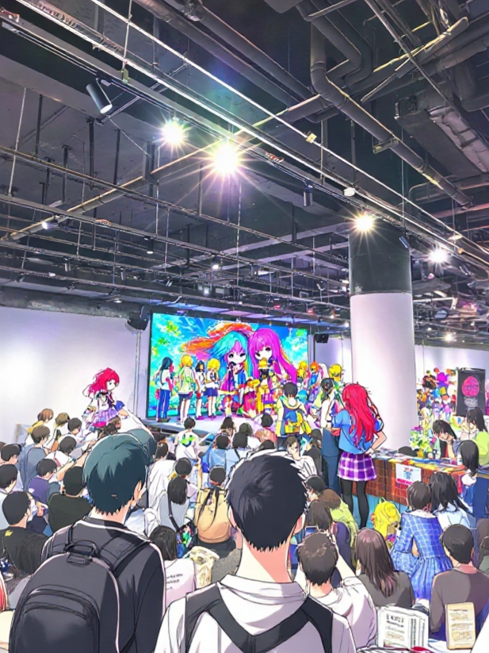
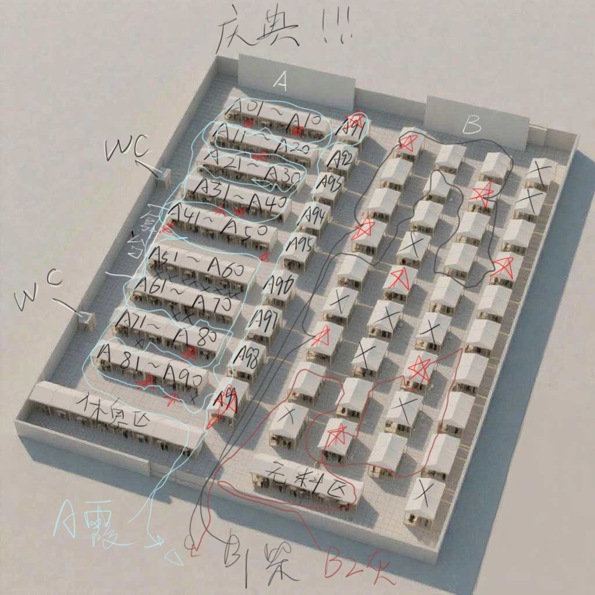

X月X日，20XX年

琦霞久违的出现在图书馆，“灰灰，你明天有没有什么事情呢~”
纸灰灰放下书本。“没什么事，怎么了姐姐？”
“有一个庆典，我想妹妹要不要也来~”
“庆典？感觉很好玩！”
“很好玩的哦！而且户国最近也免签呢”
“哇 我一直想去户国玩！”
安柴看起来很是无奈，“我记得去年年底的时候，你也用了同样的名义来邀请过我”
“咦”
“我去了会场之后被吓了一跳啊”
“人家有没有说谎嘛，庆典就是庆典嘛，一个人又辛苦还无聊...”

琦霞，安柴，纸灰灰坐在列车上。
纸灰灰：“我听说是大型庆典，不过没想到一大早就开始了，好期待”
安柴：“看来她什么都不知道呢，真可怜”
琦霞：“不不 马上就会习惯的”
安柴叹了口气，“灰灰，我事先说清楚，这从各方面来说都是非常累人的活动哦”
纸灰灰：“那我会加油的！”
安柴暗暗吐槽，“她真的明白了吗”
列车不断上着人，多为阿宅大叔们，还有一些coser

会场人超级多，纸灰灰不由得吸了口凉气，“哥哥，这里好像很可怕”
安柴：“所以我才说嘛...”

琦霞：“对了，我要趁现在把任务分配说明清楚”
“给，这里是购物清单————”

“入场后先解散”
