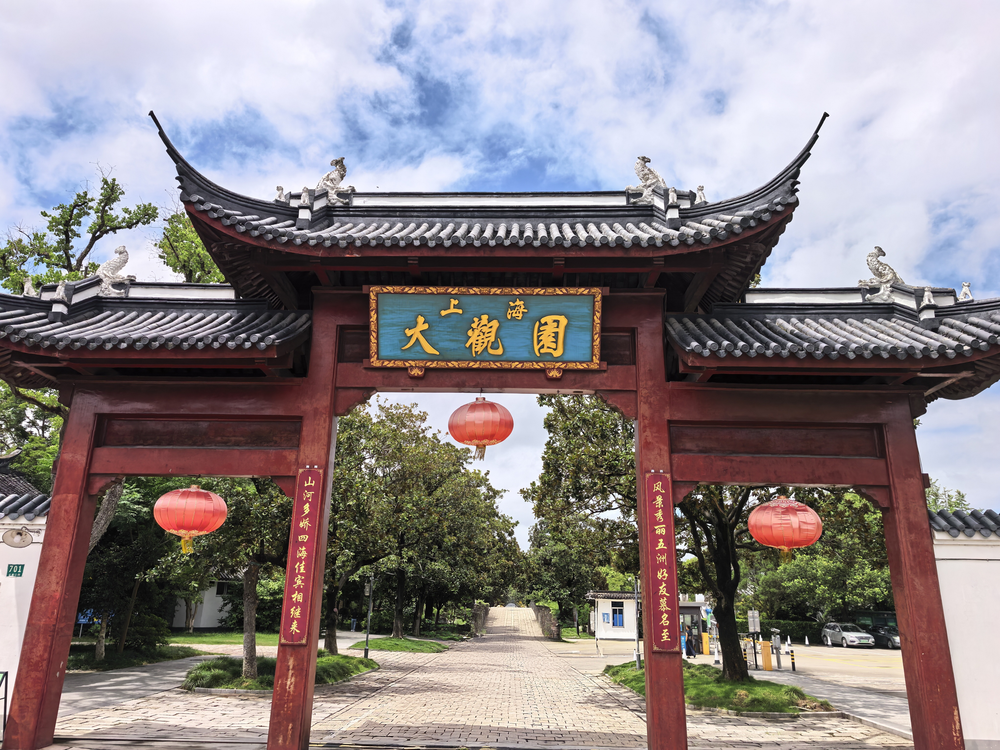
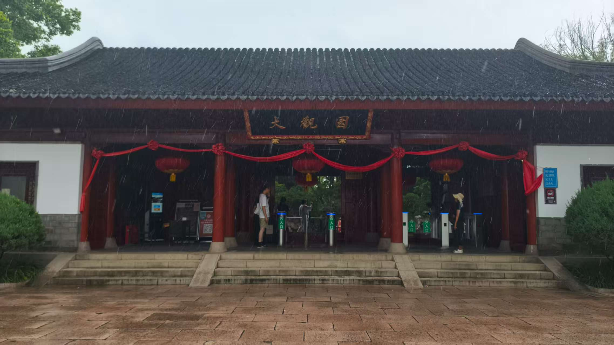
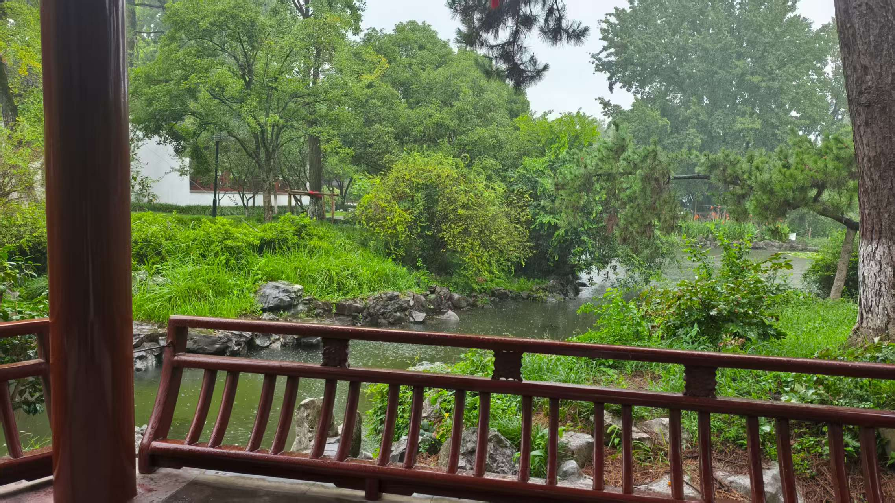

## 漫步江南
> 在某个遥远的世界中，江南的烟雨是小桥流水的诗，如瞬时之城般梦幻。记两位少女的拜访，记石板上的足迹，瓦片下的身影和水流里荡漾的欢笑。

### 源起

三点的骤雨再次洒过天空，渲染瞬时之城的生机。雨声点缀着美妙的旋律，与少女的细语应和。“三点的骤雨总是这么的美，今天的又多一分飘摇。”琦霞看着窗外呢喃。“姐姐应该知道，有风起地的卷云堆积，这几天的雨总是会被东风吹拂的...”纸灰灰撇着嘴说，“如果哥哥在的话，一定也会多记录几张的。有了这些记录，我的气象预测也会越来越准确。”两人看着窗外的雨，交谈逐渐轻了下来。也许是因为安柴最近去了星露山谷，也许是瞬时之城的探索已丰富了许多次往日的缘故，两人只静坐在回响图书馆中，缺少往常外出的欲望。琦霞看着略显无聊的妹妹，突然若有所思，“纸灰灰，上次你跟我说起来，外面的世界也有这样烟雨之地，是你一直想去的。” “是江南！”纸灰灰兴奋地支起身体，突然又放慢语调说，“哎呀，既然姐姐想去，妹妹也只能陪从了。”看着妹妹可爱的样子，姐姐只一笑说道，“那我们就明天出发吧。”

### 启程

晨光笼罩着半透明的城市，两位少女早早的来到城市边缘，准备一段旅程的开始。琦霞拉着纸灰灰的手，踏入了晨雾中若隐若现的光线轨迹。随着城市的轮廓在身后渐渐模糊，她们仿佛穿越了某种无形的边界，进入了另一个世界。当视线重新清晰时，无际的平原与水网已经展现在眼前。早在昨天晚上琦霞独自去玩耍时，纸灰灰就已做足了攻略。“先去大观园，再去周庄古镇，因为周庄古镇开放到夜晚。”纸灰灰自信地向姐姐介绍着计划。姐姐高兴地同意着，妹妹的计划总是最可靠的。姐妹俩于是打车来到了大观园。

### 两姐妹进大观园

大观园坐落在淀山湖边，是江南腹地的一片小小天地。积蓄着江南的雨水与灵气，即使不在原著的金陵，也不影响它的还原性。话虽如此，当看到姐姐兴奋地拍着景区门牌楼“上海大观园”时，纸灰灰的内心总不经掀起一阵波澜，“哎，姐姐，你说这张照片是否过于凸显它上海人造景区的特征了。”琦霞只微笑着，牵着妹妹往前走了。“可是它也很漂亮呀。”

*江南有座园子，是今天故事的开始——琦霞*

还没等姐妹俩走到大观园的门口，天空开始飘起细雨。妹妹还在看着天象，姐姐已经把伞称好了，罩着妹妹。“快把自己的伞撑起来吧，纸灰灰。”纸灰灰这才拿出伞。两人并排继续向前走去。“初入江南就体验到了两种不同的美妙景象，看来我们来得很值啊!” “是啊，阴晴不定总是江南的美。”两人有说有笑来到大观园入口，入口藏在太虚幻境的牌坊之后。“这才是真正的入口啊。”纸灰灰边说边拍着照。琦霞指着检票的通道，笑着说：“看来妹妹是觉得这里更还原了。”纸灰灰看着入口，轻声哼了一声，“应该是姐姐的照片更好”。

*据已迭失的红楼梦真本记载，探春理家时为开源节流，将大观园改为景区，通过收取门票补充收入——纸灰灰*

### 园中漫游

穿过牌坊，雨丝仿佛也沾染了墨香，变得缠绵起来。园内游廊曲折，一步一景，引得琦霞雀跃不已，拉着妹妹的手在回廊里穿行，木屐叩击石板的声音清脆动听。

“姐姐，根据我的攻略，我们应该先去潇湘馆，那里是林黛玉的住所，最能体现江南园林的清幽之美。”纸灰灰一手撑着伞，一手划着不存在的虚拟屏幕，上面是她昨晚做好的导览图。

“好呀好呀！听你的，小导游！”琦霞笑着答应，眼睛却被一座玲珑的假山吸引，“不过，我们先去爬那个看看！”

不等纸灰灰回应，她便像只小鹿一样轻快地跑了过去。姐妹俩一前一后地穿行在竹林小径中，最终抵达了潇湘馆。这里的雨声似乎格外宁静，只听得雨打翠竹，沙沙作响。

“这里就是潇湘馆，你看这些凤尾竹，正是‘凤尾森森，龙吟细细’的写照，象征着黛玉的清高孤傲。”纸灰灰指着竹林，认真地讲解起来。

琦霞却闭上了眼睛，深深吸了一口气：“雨滴打在竹叶上的声音真好听，沙沙的，像是风之精在低语。而且这雨后的味道……和瞬时之城里‘佩特里可’的甘甜不一样，多了一股竹叶的清苦味，也很好闻！”她睁开眼，指着一片竹叶上滚动的晶莹水珠，“你看，那像不像一颗迷你的‘正午晶体’？”

*这片竹林，让我想起了家。——琦霞*

离开潇湘馆，两人又来到了与之一墙之隔的怡红院。这里的景致截然不同，院内西府海棠、芭蕉、石榴等花木繁盛，虽在雨中，依旧显得富丽热闹。

“哇，这里好漂亮！”琦霞的眼睛立刻亮了起来，跑去研究一株海棠花。

“这里是贾宝玉的住处，当然是‘花团锦簇，柳绿桃红’了。”纸灰灰跟在后面，补充道，“潇湘馆清冷，怡红院富丽，正好体现了两位主人翁不同的性格和境遇。不过，我觉得还是潇湘馆的格调更高雅一些。”

“嗯……可是，”琦霞回过头，狡黠地一笑，“这里有好吃的呀！”她指向不远处挂着“怡红佳酿”招牌的食肆，“我们去看看有没有‘糖蒸酥酪’？”

“姐姐你呀，就知道吃！”纸灰灰嘴上抱怨着，脚步却很诚实地跟了上去，“根据我的资料，这里的‘茄鲞’很有名，虽然肯定不是原著里用十几只鸡配的那个啦……”

姐妹俩的说笑声，伴着雨声，一同融进了这江南的园林梦中。

*姐姐说得对，美景和美食确实不冲突。——纸灰灰*

