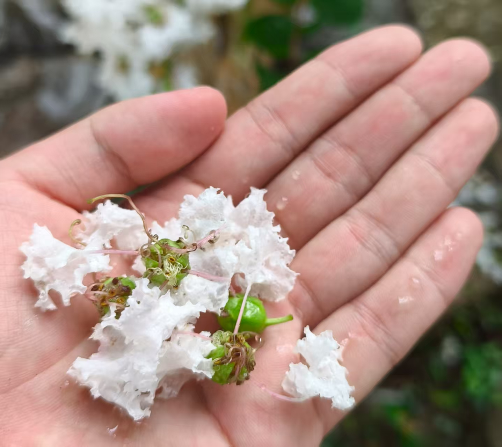

## 漫步江南
> 在某个遥远的世界中，江南的烟雨是小桥流水的诗，如瞬时之城般梦幻。记两位少女的拜访，记石板上的足迹，瓦片下的身影和水流里荡漾的欢笑。

### 源起

三点的骤雨再次洒过天空，渲染瞬时之城的生机。雨声点缀着美妙的旋律，与少女的细语应和。“三点的骤雨总是这么的美，今天的又多一分飘摇。”琦霞看着窗外呢喃。“姐姐应该知道，有风起地的卷云堆积，这几天的雨总是会被东风吹拂的...”纸灰灰撇着嘴说，“如果哥哥在的话，一定也会多记录几张的。有了这些记录，我的气象预测也会越来越准确。”

两人看着窗外的雨，交谈逐渐轻了下来。也许是因为安柴最近去了星露山谷，也许是瞬时之城的探索已丰富了许多次往日的缘故，两人只静坐在回响图书馆中，缺少往常外出的欲望。

琦霞看着略显无聊的妹妹，突然若有所思，“纸灰灰，上次你跟我说起来，外面的世界也有这样烟雨之地，是你一直想去的。” “是江南！”纸灰灰兴奋地支起身体，突然又放慢语调说，“哎呀，既然姐姐想去，妹妹也只能陪从了。”看着妹妹可爱的样子，姐姐只一笑说道，“那我们就明天出发吧。”

### 启程

晨光笼罩着半透明的城市，两位少女早早的来到城市边缘，准备一段旅程的开始。琦霞拉着纸灰灰的手，踏入了晨雾中若隐若现的光线轨迹。随着城市的轮廓在身后渐渐模糊，她们仿佛穿越了某种无形的边界，进入了另一个世界。当视线重新清晰时，无际的平原与水网已经展现在眼前。

早在昨天晚上琦霞独自去玩耍时，纸灰灰就已做足了攻略。“先去大观园，再去周庄古镇，因为周庄古镇开放到夜晚。”纸灰灰自信地向姐姐介绍着计划。姐姐高兴地同意着，妹妹的计划总是最可靠的。姐妹俩于是打车来到了大观园。

### 两姐妹进大观园

大观园坐落在淀山湖边，是江南腹地的一片小小天地。积蓄着江南的雨水与灵气，即使不在原著的金陵，也不影响它的还原性。

话虽如此，当看到姐姐兴奋地拍着景区门牌楼“上海大观园”时，纸灰灰的内心总不经掀起一阵波澜，“哎，姐姐，你说这张照片是否过于凸显它上海人造景区的特征了。”琦霞只微笑着，牵着妹妹往前走了。“可是它也很漂亮呀。”

*江南有座园子，是今天故事的开始——琦霞*

还没等姐妹俩走到大观园的门口，天空开始飘起细雨。妹妹还在看着天象，姐姐已经把伞称好了，罩着妹妹。“快把自己的伞撑起来吧，纸灰灰。”纸灰灰这才拿出伞。两人并排继续向前走去。“初入江南就体验到了两种不同的美妙景象，看来我们来得很值啊!” “是啊，阴晴不定总是江南的美。”

两人有说有笑来到大观园入口，入口藏在太虚幻境的牌坊之后。“这才是真正的入口啊。”纸灰灰边说边拍着照。琦霞指着检票的通道，笑着说：“看来妹妹是觉得这里更还原了。”纸灰灰看着入口，轻声哼了一声，“应该是姐姐的照片更好”。

*据已迭失的红楼梦真本记载，探春理家时为开源节流，将大观园改为景区，通过收取门票补充收入——纸灰灰*

### 园中漫游

#### 初入牡丹亭 

穿过入口，映入眼帘的便是一座苍郁的假山。细雨拍打在高低错落的树叶上，给这片净土罩上一层朦胧，也为藏在背后的亭台楼阁增添了一抹神秘。

“姐姐你看，那假山后面是不是有个小亭子？”纸灰灰拉了拉琦霞的袖子，眼中满是好奇。琦霞顺着她的目光望去，微笑着点头：“是啊，江南的园林总喜欢把景致藏起来，要走近了才会发现更多美好。”纸灰灰眨了眨眼，悄声说：“我们要不要过去看看？让我猜猜是大观园中的那座亭子。”琦霞轻轻一笑，牵起妹妹的手：“我可要眼见为实。”两人相视一笑，踏着青石板，向假山左边的路走去，细雨中留下了并肩的足迹。

大观园内景致层出不穷，步步皆景。琦霞本想快步前行，却总被眼前的美景吸引，不时停下脚步欣赏。途中偶遇一只悠闲的小猫，琦霞忍不住蹲下逗弄片刻。待两人再次启程，终于来到了那座亭子前。

纸灰灰抬头看着牌匾，兴奋地说：“是牡丹亭欸，在《红楼梦》中这里可是有著名的故事。”琦霞也被妹妹的情绪感染，轻声道：“你还记得贾宝玉和林黛玉在这里吟诗的情景吗？”纸灰灰点点头，眼里闪烁着光芒，“当然记得，‘良辰美景奈何天，赏心乐事谁家院’，小时候我最喜欢背这句了。”两人相视一笑，仿佛时光倒流，置身于书中的梦境。

细雨中，亭檐下的青石板泛着微光，姐妹俩在亭中坐下，望着园林深处的曲径通幽。远处传来几声鸟鸣，雨丝轻敲着瓦片，仿佛为她们的对话伴奏。纸灰灰从包里拿出随身携带的小本子，认真地在上面记下此刻的心情。

“姐姐，你觉得江南的雨和瞬时之城的雨，有什么不同吗？”纸灰灰忽然问道。琦霞想了想，微笑着回答：“江南的雨更温柔，像是有故事的，能把人带进诗里。”纸灰灰点头，低声说：“那我们以后还要一起去更多有故事的地方。”

两人静静地坐在亭中，任思绪随雨丝飘远，仿佛整个大观园都只属于她们的回忆与梦想。

*“良辰美景奈何天，赏心乐事谁家院~”——纸灰灰*

#### 荷塘小憩

两人静坐片刻，琦霞却早已按捺不住探索的心情。“你可要追上我呀！”她扬起伞，话音未落便轻快地跑远了。“姐姐真坏，居然不等我！”纸灰灰一边收拾东西，一边嘟囔着起身，可抬头时，姐姐的身影早已消失不见。就在这时，手机屏幕亮起，琦霞发来消息：“好妹妹，你能否寻得我的踪迹？”纸灰灰仿佛能想象到姐姐得意的神情，便加快脚步，沿着她消失的方向追去。“我可记得路，姐姐甩不掉我！”正想着，又收到一张荷塘的照片，和一句调皮的话：“我正在盯着妹妹呢。”

*好妹妹，你能否寻得我的踪迹？——琦霞*

纸灰灰环顾四周，只见小径蜿蜒、楼阁错落，却不见荷塘的踪影。“右边的小径通往蘅芜苑，肯定不是那边。左侧那幢楼夹在小河与来时的路之间，也不对。看来只能在中间这座楼后面了。”她心中暗自分析，便快步走向那座楼。果然，在楼的一角看见了姐姐的身影。荷塘便静静地铺展在楼后，碧叶连天，荷花点缀其间，宛如一幅生动的江南画卷。

“接天莲叶无穷碧的荷塘，是不是很美？”琦霞笑着问妹妹。纸灰灰却有些不满地嘟囔道：“姐姐你走得太快了，把我都累坏了。我还背着包呢，早知道就不帮你带饮料了。”说着，她从包里拿出两瓶茉莉花茶，递给姐姐一瓶。“还是妹妹最好！”琦霞宠溺地拍了拍纸灰灰的肩膀，“要不等会儿我帮你背包吧？”纸灰灰摇摇头，认真地说：“这是我的包，当然要我自己背。不过你可以帮我把包里的东西吃掉，这样就不重了。”说罢，又从包里拿出糖果，与姐姐一同分享。姐妹俩一边喝着茶，一边吃着糖，悠然自得地坐在荷塘边，享受着这份静谧与惬意。

“哇，真的是茉莉花！”琦霞拿起茉莉花茶的瓶子，将瓶身上的插画与身旁盛开的茉莉花细细比对，果然如出一辙。纸灰灰则弯腰拾起石头上被雨水洗净的小花，轻轻托在掌心。洁白的花瓣上缀着晶莹的雨珠，仿佛瞬时之城晨雾中最澄澈的光。纸灰灰凝视着掌中的落花，心头不由泛起一丝淡淡的惆怅——如此美丽终究会归于尘土。琦霞似乎一眼看穿了妹妹的心思，轻声笑道：“你又在想着学黛玉葬花了吧？”纸灰灰嘴角微扬，轻轻摇头：“不过是触景生情，偶尔附庸风雅罢了，我可没黛玉那么多愁善感。”

*却无处觅一块布，包起这些落花——纸灰灰*

#### 怡红院寻幽

休息片刻后，两人决定按顺序游览大观园。琦霞收起伞，轻快地站起身："走吧，我们去怡红院看看。"纸灰灰点点头，将小本子放回包里，跟着姐姐向前走去。

怡红院是大观园的核心建筑，朱红色的门楣在细雨中显得格外庄重。然而，当两人走近时，却发现门前有一只橘色的小猫正悠闲地徘徊着。小猫毛色温润，在雨后的青石板上留下浅浅的爪印。

"哎呀，这只小猫是不是饿了？"琦霞蹲下身，从包里拿出剩下的糖果，"来，给你吃糖。"小猫却只是用那双琥珀色的眼睛看了她一眼，然后继续在门前踱步，尾巴优雅地摆动着。

纸灰灰见状，轻声笑道："姐姐，小猫不是饿了，它是在享受这份闲逸呢。你看它多自在，就像这江南园林一样，不需要什么目的，只是存在就很美。"琦霞恍然大悟，收起糖果，温柔地看着小猫："原来如此，是我太着急了。"

两人轻手轻脚地绕过小猫，推开了怡红院的大门。院内空间开阔，雕梁画栋间透着古典的雅致。她们漫步在各个房间中，感受着韵味。琦霞环顾着四周的布置，沉浸于建筑的感触中，而纸灰灰则好奇的留意细节，想发现与原著呼应的事物。

逛完怡红院的主要房间，两人来到了后院。这里有一座水绕的假山，山石嶙峋，流水潺潺，在细雨中更显灵动。假山倒映在水中，与周围的绿植相映成趣，宛如一幅水墨丹青。

"这里真美，"琦霞感叹道，"是江南别样的精致。"纸灰灰点头附和："江南园林讲究'虽由人作，宛自天开'，每一处都是精心设计的艺术品。"

#### 往湖边的小径

游览完毕，两人准备离开怡红院。琦霞走在前面，正打算原路从正门出去，纸灰灰却突然开口："姐姐，我们走后门吧。"

"后门？为什么？"琦霞有些疑惑。

纸灰灰眼中闪过一丝狡黠："因为贾宝玉就经常从后门出去找黛玉玩啊。后门的小径更有诗意，说不定能遇到什么有趣的事情。"琦霞被妹妹的话逗笑了："好吧，那就听你的，走后门。"

怡红院的后门掩映在一片藤萝之中，青翠的藤蔓从墙头垂下，形成了一道天然的绿色帘幕。两人穿过藤萝遮盖的小径，脚下是湿润的青石板，空气中弥漫着泥土和植物的清香。

就在这时，一只彩色的蝴蝶从藤萝间翩翩飞过，翅膀上的花纹在阳光下闪闪发光。纸灰灰兴奋地指着蝴蝶："姐姐快看，好漂亮的蝴蝶！"琦霞也被这美丽的景象吸引，两人不约而同地追着蝴蝶向前跑去。

蝴蝶轻盈地飞舞着，带着她们穿过蜿蜒的小径，最终停在了滴翠亭前。这是一座小巧精致的亭子，四周被一片生机勃勃的小湖环绕。湖中荷叶田田，几朵荷花含苞待放，水面上倒映着亭子的倒影，宛如一幅天然的画卷。

纸灰灰从亭子里走出来，站在湖边欣赏着美景。琦霞则还在亭子中，靠着柱子认真地拍照，想要将这美好的瞬间永远保存下来。

#### 栊翠庵品茶

两人随后沿着一条幽静的小路继续前行，来到了栊翠庵。这是一座古朴的寺庙，青砖黛瓦间透着岁月的痕迹。寺庙后面有一座小巧的亭子，亭中摆放着石桌石凳，四周绿树环绕，环境清幽。

纸灰灰看着亭子，眼中闪烁着兴奋的光芒："姐姐，我们在这里喝茶吧！这里的环境太适合品茶了。"琦霞欣然同意："好主意，正好我们还有茉莉花茶。"

两人在亭中坐下，从包里拿出茉莉花茶。茶瓶在石桌上发出清脆的碰撞声，两人相视一笑，不约而同地将茶瓶碰在一起，发出"叮"的一声轻响。

琦霞轻抿一口茶，望着亭外的绿意："这里喝茶，有一种格外的香韵。"纸灰灰也端起茶瓶，目光温柔地看着姐姐："是环境的清雅呀。"

茉莉花茶的清香在亭中弥漫，与周围的绿意和远处的钟声交织在一起。两人静静地坐着，偶尔交换一个会心的微笑，在这宁静的茶亭中，时光仿佛变得缓慢而珍贵。

#### 大观楼前

#### 屋宇穿行

### 江南食话
走出大观园，已是午后了。大观园外的石板路吹拂着清风，送着两人向大门走去。渐渐地，纸灰灰的脚步慢了下来，说着：“我有点饿了，姐姐呢？”琦霞说：“我还好。这边可没什么吃的。谁让妹妹不吃早饭呢？”纸灰灰有点失望地看着琦霞，“姐姐你……”琦霞于是笑着接着说：“我听说周庄古镇周围有很多江南特色美食哦。”纸灰灰神色一转，高兴地说：“对哦，我们正好过去吃，好完美的计划！”

纸灰灰于是打开手机，开始寻找古镇边的美食了。她浏览者不同的店和菜肴，不时分享给姐姐看。“万三蹄是周庄的特色菜，一定要吃。姐姐觉得怎么样？” “时蔬也不错。”琦霞一边回应着纸灰灰，一边把去周庄的车打好了。在去古镇的路上，两人选好了一家店，作为午餐。

周庄和上海大观园虽相隔不远，却是迥乎不同的景象。不比湖淀的辽阔与宁静，但有烟火味的热闹。街道盘布满了琳琅满目的门店。比如好几家主打万三蹄的小吃店。红彤彤的猪蹄在映照在橙黄色的灯光下，迸发诱人的香甜。饥饿的纸灰灰虽然常常看着路过的猪蹄店，却对琦霞说：“等下我们就能吃到了，饭店里的一定更香。”

选定的饭店依傍在河边，浸润于流水的声响和夏日的光彩。还有一座石拱桥坐落在一旁，标榜着江南的特色。两人默契地选了一个窗边的桌子，点好了餐。

第一个上的菜是淮扬煮干丝。雪白的豆腐丝与肚丝交织，浸润于微黄的汤中，有融洽的和谐。还有绿色的青菜丝和红色的胡萝卜丝点缀，让这道菜的色彩十分的丰富。纸灰灰已经按捺不住了，说着“我们开吃吧。”琦霞点点头，纸灰灰就拿着筷子夹了一把豆腐丝与肚丝，送入嘴中。“哇，好鲜！”琦霞优雅地拿起筷子，拣起几根丝条，品尝着。“确实不错！”“嗯。嗯。”纸灰灰又吃了好几口。暗自可惜着干丝不饱腹，于是让香气浸润于唇间。

接着又上了土鸡煲。鸡块裹着浓郁的酱汁，与彩椒混合，色香味俱全。品尝着咸香的鸡肉，两人都赞许有加。鸡肉纤维中的蛋白质与脂肪，更是解救纸灰灰于饥饿的初见。几块骨头转眼出现在纸灰灰的碗边。

看着沉浸于与美食战斗的纸灰灰，琦霞留意到佳肴并没有配上饮品，于是说：“吃这么多菜会有点咸吧。我前面看到旁边有一家奶茶店，我去买两杯，妹妹先吃哦。”纸灰灰微笑地看着姐姐：“谢谢姐姐，还是姐姐懂我。”看着琦霞起身去买奶茶，纸灰灰不觉放慢了进食的速度，心想着要给姐姐多留点。

随后上了一道炒蛋。一大盘鲜黄的鸡蛋，香气扑鼻。还有一些白色的小条贯穿在蛋中，活灵活现。纸灰灰想都没想，夹了一口。一嚼才发现有蛋中有鱼的味道，恍然大悟。“原来这白色的条就是周庄特产的银鱼啊。”这种小鱼没有刺，肉质也非常的软嫩。夹杂在蛋花中，口感浑然一体，却给蛋花平添了一抹江南的水的新鲜。可惜纸灰灰并不喜欢吃鱼，于是没有去尝第二口，但她觉得姐姐会喜欢吃的。

时蔬和毛豆上的恰到其时。时蔬绿在新鲜的色泽，而毛豆则与阿婆菜相伴，展示沉淀的太阳与雨的韵味。对于饱尝了咸香的口腔，这两者是再好不过的调律了。

万三蹄压轴登场，琦霞也正好回来了。

### 古镇寻踪

#### 免费的探索

#### 屋角，桥边，茶楼上

##### 大街热闹，长堤阔远，小径清幽

#### 流连与徘徊

### 归程

