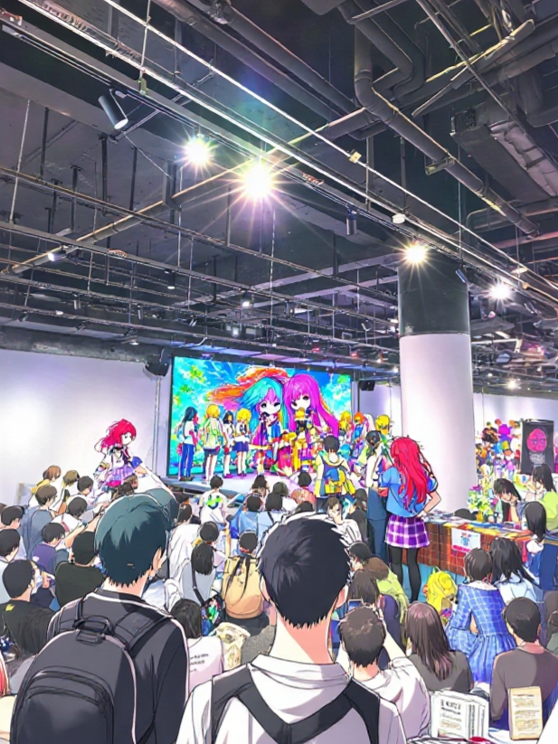
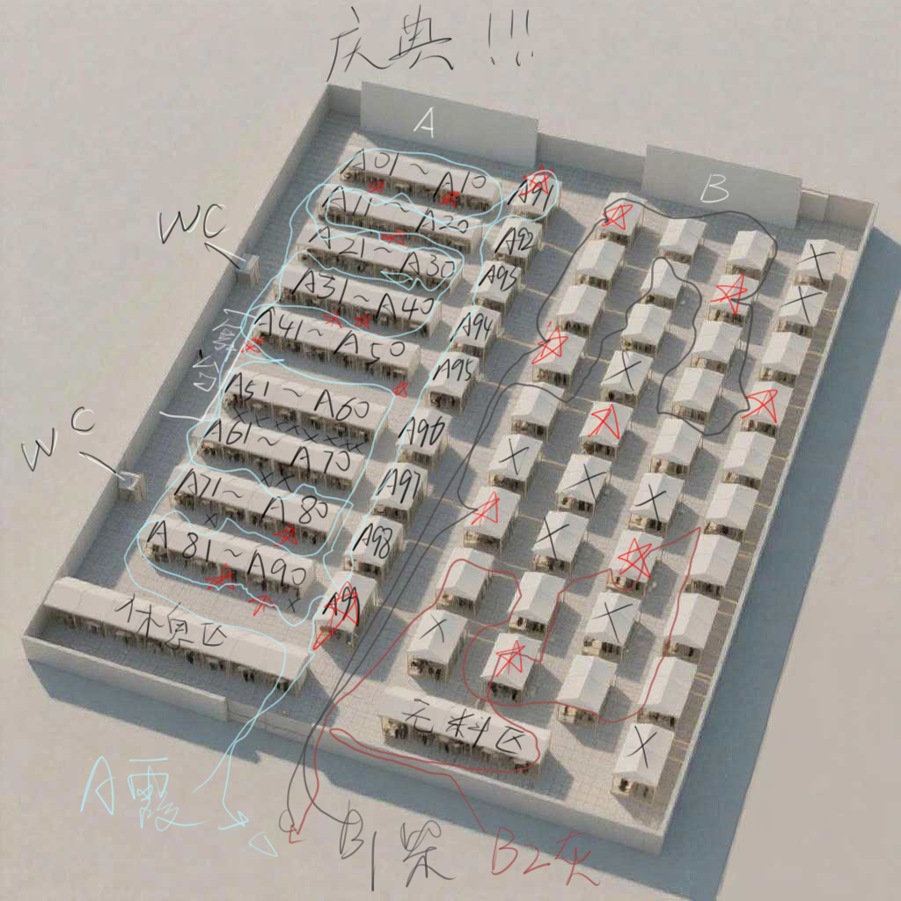
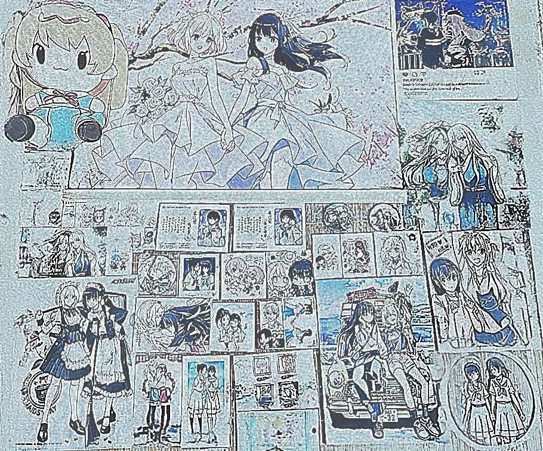
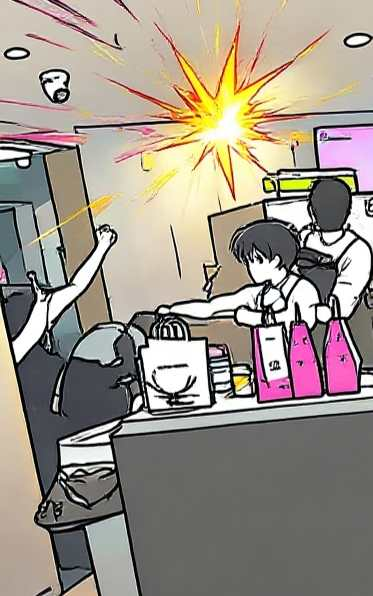

by 琦霞

X月X日，20XX年

### 1

琦霞久违的出现在图书馆，“灰灰，你明天有没有什么事情呢~”

纸灰灰放下书本。“没什么事，怎么了姐姐？”

“有一个庆典，我想妹妹要不要也来~”

“庆典？感觉很好玩！”

“很好玩的哦！而且户国最近也免签呢”

“哇 我一直想去户国玩！”

安柴看起来很是无奈，“我记得去年年底的时候，你也用了同样的名义来邀请过我”

“咦”

“我去了会场之后被吓了一跳啊”

“人家有没有说谎嘛，庆典就是庆典嘛，一个人又辛苦还无聊...”

### 2

琦霞，安柴，纸灰灰坐在列车上。

纸灰灰：“我听说是大型庆典，不过没想到一大早就开始了，好期待”

安柴：“看来她什么都不知道呢，真可怜”

琦霞：“不不 马上就会习惯的”

安柴叹了口气，“灰灰，我事先说清楚，这从各方面来说都是非常累人的活动哦”

纸灰灰：“那我会加油的！”

安柴暗暗吐槽，“她真的明白了吗”

列车不断上着人，多为阿宅大叔们，还有一些coser

### 3

会场人超级多，纸灰灰不由得吸了口凉气，“哥哥，这里好像很可怕”

安柴：“所以我才说嘛...”

琦霞：“对了，我要趁现在把任务分配说明清楚”

“给，这里是购物清单————”

“入场后先解散，然后按照这上面的路线进行”

“标星的有出售限量版周边，打叉的摊位是因为存货很多下午再去也行...”

“对了 给你们俩钱包，要是买不起就亏大了”

安排了很多任务，安柴和纸灰灰如此多才多艺的人，大脑也处理不来这么多信息

### 4

不出所料，对于第一次来这种场合的纸灰灰，被人群给冲散

孤苦伶仃的纸灰灰感受着张袂成阴，挥汗成雨，比肩继踵而在

大量参加者的汗水化作蒸汽，在空中形成的云，浓烟滚滚的...

但是！此时此刻，纸灰灰瞥到旁边的摊位，上面是**play，这对她来说很不合适，但是她实在无法抑制住自己的心

店主挂着一丝笑容：“有兴趣看看吗？很有趣哦”

被这么说住的纸灰灰念叨“只看一下下...”终于，她打开了《縛**記♂》，虽然为之震撼，但是她买下了这本漫画！因为这是学习用！

### 5

中午*

一脸开心的姐姐与一脸憔悴的兄妹

他们费尽千辛万苦，总算是坐下来了。

这是战利品！

### 6

“好啦 下午我们就随便逛逛啦”，琦霞安抚着因为被人群挤走不能完成任务而难过的妹妹。

“你还真有劲啊...”安柴感叹。

“底迪，我的異種族****有买么，我忘记标出来了，所以发了短信给你，但是你没有回我消息”

“这个自然是买了，我对能经常线下见面的人向来是不回消息的”

“喂 偶尔也给点反馈好不好...”

### 7

一旁的摊位出现了状况！

“真的非常抱歉，顾客大人！很遗憾，限定商品已经全部卖完了！”————店员1

“真的吗”

“真的，谁叫你这个时候来哎”————店员2

“虽然你很可怜，但不从早上开始排...”————店员2

店员2被打断了！

店员1揍了店员2！

“混账东西！即使是没有买到东西的顾客，也要全力让他满足啊混蛋！”

哦哦哦哦哦哦哦哦哦！好热血！

“你怎么能忘记这精神！”

“可...可是...这店里已经只剩下卖剩的商品了”

“你说卖剩的...？卖剩的东西有福气！！”

原来是这样吗！！

“不受流行作品以及没营养的萌所影响，这是能发掘出东西真正价值的好机会！！”

“在这个限定商品全灭的时刻，才是企业展真正的战斗不是吗！”

“原来如此...”

“那么，你来向这位顾客推荐看看吧！你所认为的真正的宝物！”

“有什么...有什么武器吗，这个如何！”店员2掏出了一张沉昆！

“错！应该是这个！”店员1掏出了一张陆猩！

“不是啊，你看，狗狗热卖成那样，我们是这副惨样啊”

“闭嘴，我这三年前就卖不出去了”

“不 我想要的是莫伯桑...”路人男低语

琦霞：“那边的情绪总是很高涨呢~”

安柴和纸灰灰已经找不到吐槽的点“是这样吗...”

### 8
因为各位已经没有精力继续参与庆典了，琦霞倒是安分下来了，开始感叹今天是个大晴天之类的事情。

纸灰灰发现路边一家名为“Himmel”的咖啡馆，感觉是个躲太阳的好地方。

安柴像是想到了什么，视线停留在咖啡馆上了一会，但是被姐姐一下拽进去

纸灰灰：“哥哥，你刚才在看什么？”

安柴开始展示他的博学：“放晴...联系起咖啡馆的名字Himmel，不难想到这是德语中‘天空’的意思，说不定是因为晴天才使我们与这家咖啡馆相遇。”

“此话怎讲？”琦霞也来了兴致

“回忆有如阴云，令对方的脸庞暧昧不清，好像记不清她含笑的眼睛，风拂的头发，泪痣怎样落在侧颜...只当晴风吹来才显露出被忆霭笼罩的天空。原来予晴以晴，予花以绽是因为只有放晴时分才能再度把你看见...”

纸灰灰和琦霞都对安柴的文采赞不绝口！

### 9
纸灰灰实在是看不下去姐姐试图大点特点，不禁进谏：“将军如此奢靡，汉室岂不危矣？望将军勤俭节约...”

结果！纸灰灰成功把648的价格搞到68了！琦霞更是坦言：“我以后要把付款方式改成灰宝支付。”

真好！今天又是充实的一天！

